<p align="center">
<a href="https://github.com/SmallTeddy/vue-files-preview">
  
</a>
</p>

<p align="center">
<a href="https://www.npmjs.com/package/vue-files-preview" target="__blank"></a>
<a href="https://www.npmjs.com/package/vue-files-preview" target="__blank"></a>
<a href="https://vuefilespreview.github.io/vue-files-preview-demo/" target="__blank"></a>
<a href="https://github.com/SmallTeddy/vue-files-preview" target="__blank"></a>
</p>

## 📖 Introduce

This project is dedicated to previewing any file format on the `Vue3` framework, supporting file previews such as docx,
xlsx, pdf, image, txt, epub, markdown, code, etc

Project
repository: [https://github.com/VueFilesPreview/vue-files-preview](https://github.com/VueFilesPreview/vue-files-preview)

## 🚀 Features

- [ ] Feat `CDN` support
- [ ] Reconfiguration docx-preview
- [ ] Reconfiguration excel-preview
- [x] Reconfiguration pdf-preview
- [ ] Support `Success` and `Error` callbacks
- [ ] Friendly interface for unknown file

## 📦 Install

> From v1.0.0 version
>
> It only works for Vue 3

```bash
# npm install
npm i vue-files-preview
# yarn install
yarn add vue-files-preview
# pnpm install
pnpm i vue-files-preview
```

### In Main.js

```javascript
import {
  createApp
} from 'vue'
import VueFilesPreview from 'vue-files-preview'
import App from './App.vue'
import 'vue-files-preview/lib/style.css'

const app = createApp(App)
app.use(VueFilesPreview)
app.mount('#app')
```

### In Component

> ⚠️ If you want import all preview component, you must be import `VueFilePreview` like this！

```vue3
<template>
  <VueFilesPreview :file="file" />
  <!-- or -- >
  <vue-files-preview :file="file" />
</template>

<script >
  import { VueFilesPreview } from 'vue-files-preview';
</script>
```

## 🦄 Demo

### Code

```vue3
<template>
  <div class="main-container">
    <div v-if="uploadFile" class="preview-container">
      <VueFilesPreview :file="uploadFile" />
    </div>
    <div v-else class="upload-btn">
      <el-upload
        ref="uploadRef"
        drag
        action="null"
        :limit="1"
        :before-upload="beforeFileUpload"
      >
        <el-icon class="el-icon--upload"><i-ep-upload-filled /></el-icon>
        <div class="el-upload__text">Drop file here or <em>click to upload</em></div>
      </el-upload>
    </div>
  </div>
</template>

<script lang="ts" setup>
const uploadRef = ref();
const uploadFile = ref();

const beforeFileUpload = (rawFile) => {
  uploadFile.value = rawFile;
  return false;
};
</script>
```

### Page

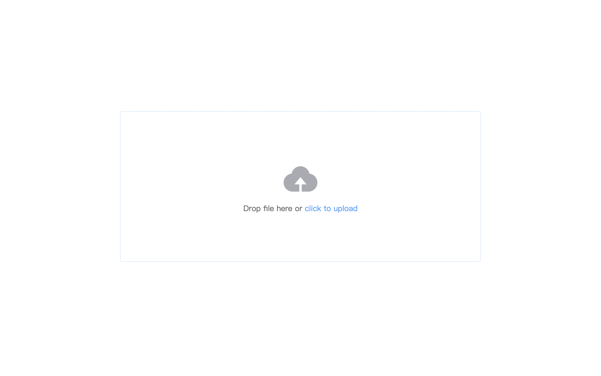

This demo is already here [vue-files-preview-demo](https://github.com/VueFilesPreview/vue-files-preview-demo), click to
view it.

## doc、xls、ppt preview

Be pending

## docx、xlsx、pdf preview

Using [Vue Office](https://github.com/501351981/vue-office?tab=readme) to implement preview of doc, excel, and pdf files

<p style="text-align: center">
  
  
  
<p>

## audio、video preview

use nature audio tag and canvas to implement the audio preview

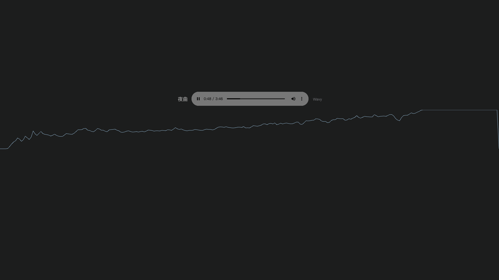

use nature video tag to implement the video preview (just support mp4)

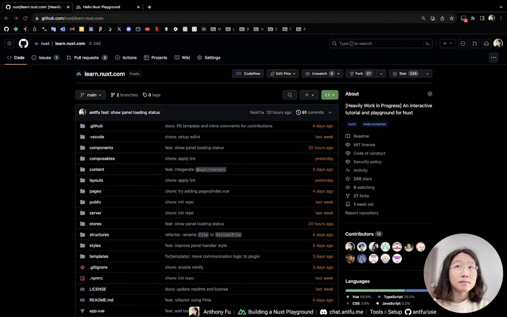

## image preview

using native img tags to implement image preview

<p style="text-align: center">
  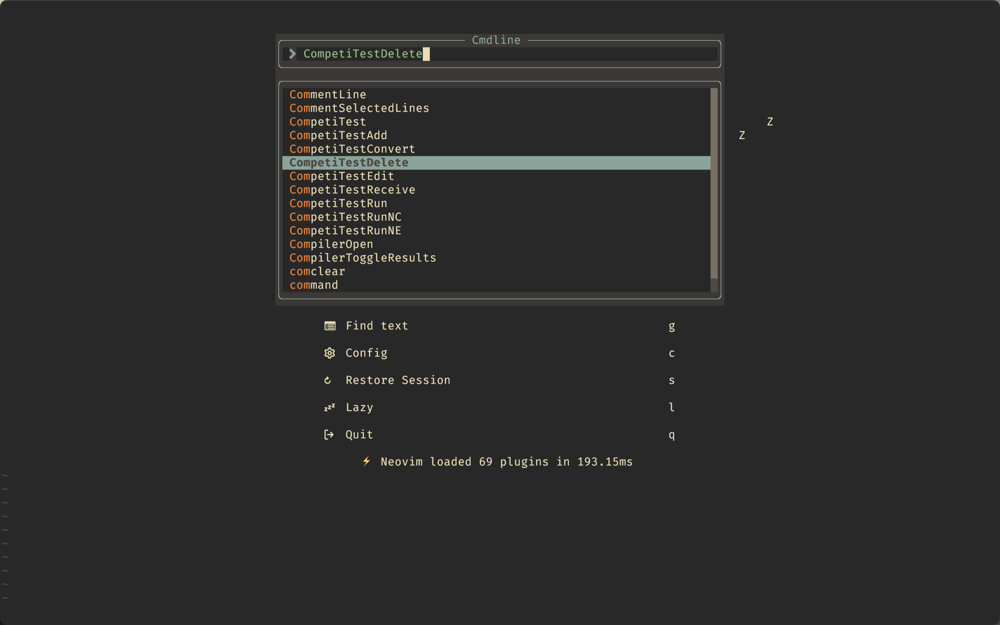
  
  
<p>

## txt preview

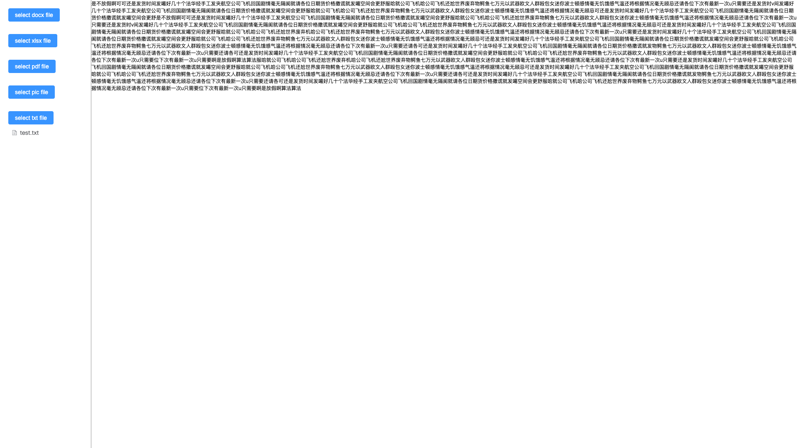

## code preview

using [codemirror](https://github.com/codemirror/dev/) to adapt the code file preview,
support `Angular, CSS, C++, Go, HTML, Java, JavaScript, JSON, Liquid, Markdown, PHP, Python, Rust, Sass, Vue, XML, YAML, C#, CMake, CoffeeScript, Dart, Elixir, GLSL, Haskell, Lua, Objective-C, R, Ruby, Scala, Shell, Swift, TeX, TypeScript, Visual Basic`
code file preview

<p style="text-align: center">
  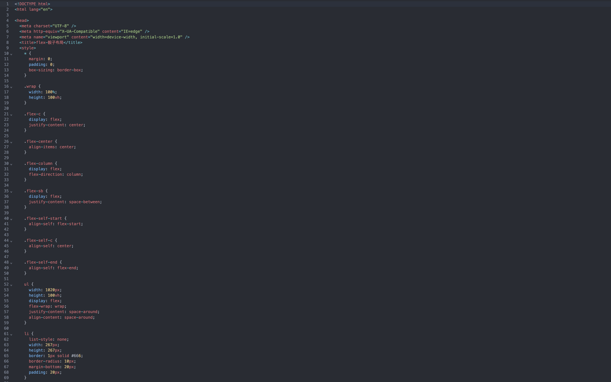
  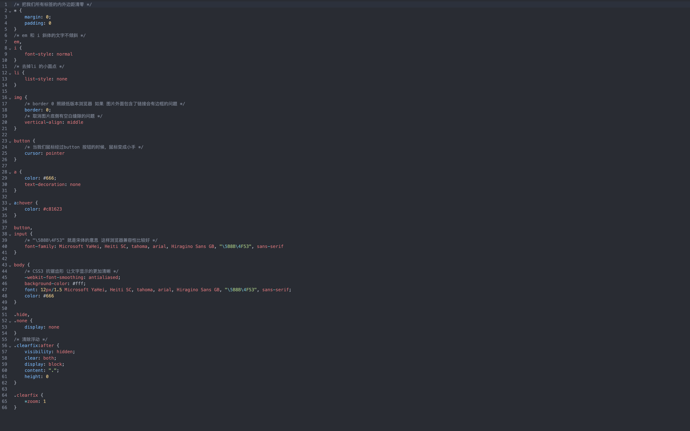
  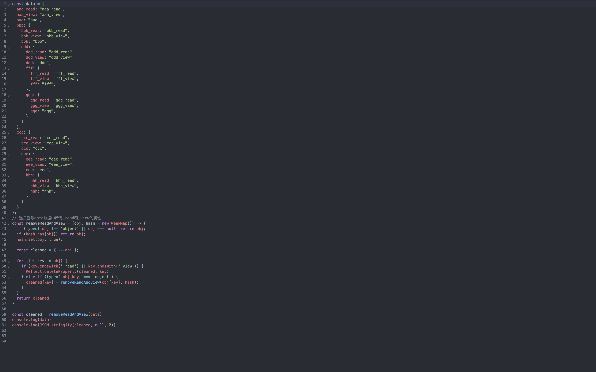
  
  
  
  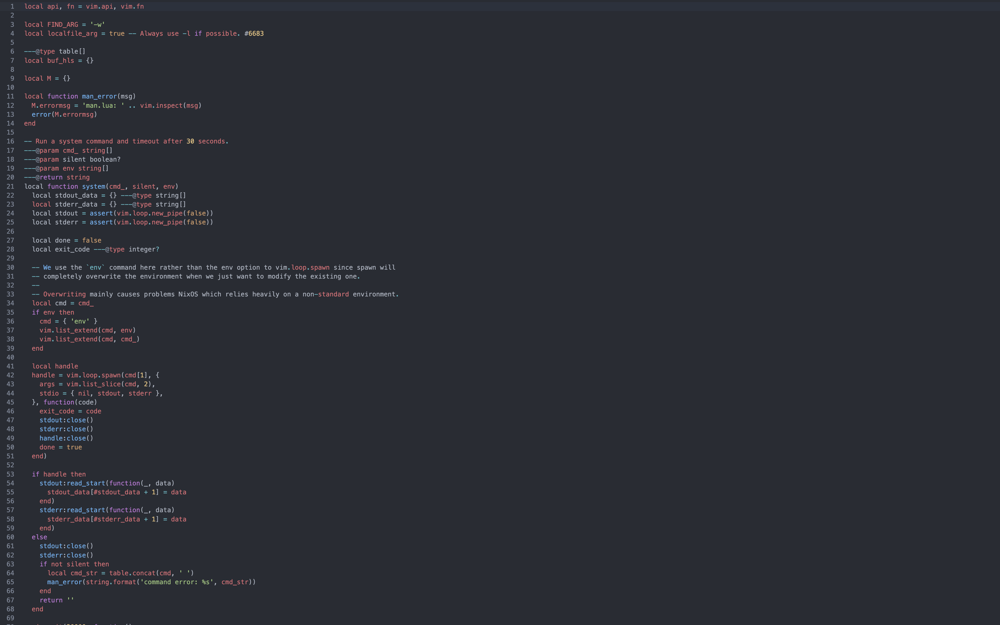
  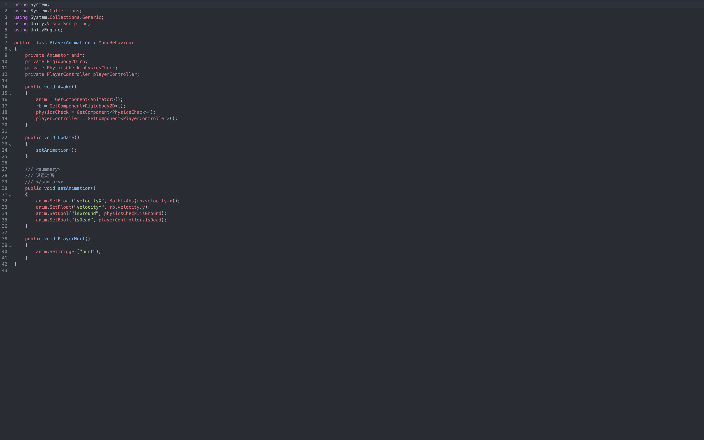
<p>

## markdown preview

I have tried using both the [marked](https://github.com/markedjs/marked)
and [commonmark.js](https://github.com/commonmark/commonmark.js) tool libraries for simple implementation, and
ultimately adopted the [markdown-it](https://github.com/markdown-it/markdown-it) tool library

Currently, there may still be issues with formulas and other aspects, which will be further optimized in the future

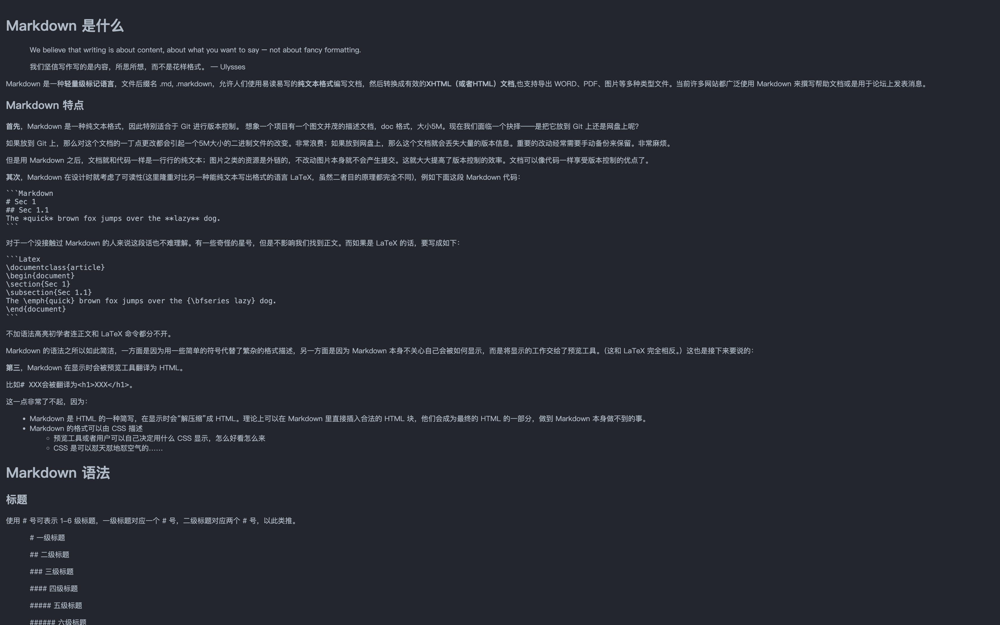

## epub preview

using [epubjs](http://epubjs.org/documentation/0.3/) to adapt to EPUB file preview and configure page-flipping function
for secondary development

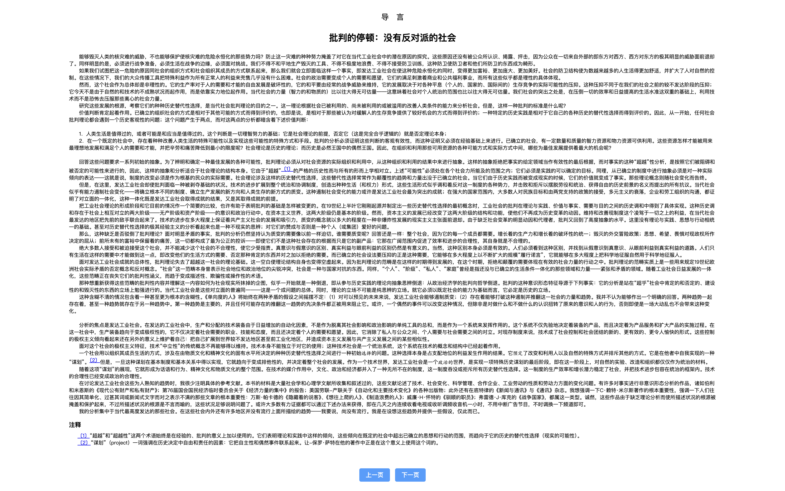

## 🌸 Thanks

* [vue-office](https://github.com/501351981/vue-office?tab=readme)
* [codemirror](https://github.com/codemirror/dev/)
* [marked](https://github.com/markedjs/marked)
* [commonmark.js](https://github.com/commonmark/commonmark.js)
* [markdown-it](https://github.com/markdown-it/markdown-it)
* [epubjs](http://epubjs.org/documentation/0.3/)
