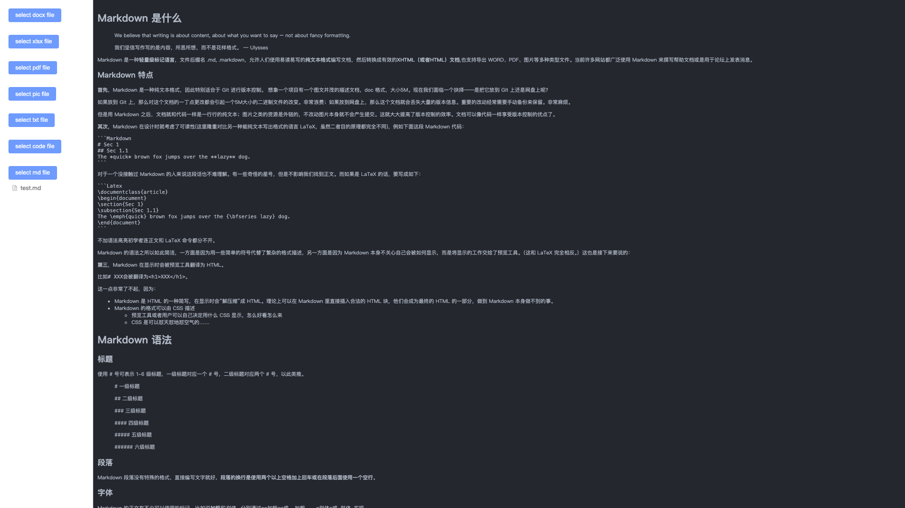

# Vue3 Preview

## 1、doc、xls、ppt 解决方案

待定

## 2、docx、xlsx、pdf 解决方案

使用[vue-office](https://github.com/501351981/vue-office?tab=readme-ov-file)，支持word(.docx)、excel(.xlsx)、pdf等各类型office文件预览的vue组件集合，提供一站式office文件预览方案，支持vue2和3，也支持React等非Vue框架。Web-based pdf, excel, word preview library

## 3、audio、video 解决方案

使用原生或寻找框架

## 4、image 解决方案

使用原生或 `element` 中图片预览组件

## 5、txt 解决方案

## 6、code 解决方案

使用[codemirror](https://github.com/codemirror/dev/)来适配代码预览，支持Angular, CSS, C++, Go, HTML, Java, JavaScript, JSON, Liquid, Markdown, PHP, Python, Rust, Sass, Vue, XML, YAML, C#, CMake, CoffeeScript, Dart, Elixir, GLSL, Haskell, Lua, Objective-C, R, Ruby, Scala, Shell, Swift, TeX, TypeScript, Visual Basic等代码显示

## 7、markdown 解决方案

先后试用了[marked](https://github.com/markedjs/marked)和[commonmark.js](https://github.com/commonmark/commonmark.js)工具库简单实现，最终采用[markdown-it](https://github.com/markdown-it/markdown-it)工具库，目前公式等可能还存在问题，后续再优化

## 8、epub 解决方案

使用[epubjs](http://epubjs.org/documentation/0.3/)来适配epub文件预览，二次开发配置翻页功能

